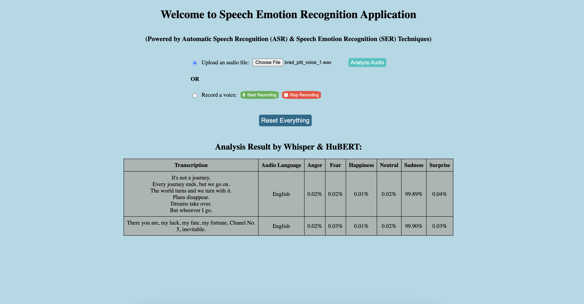

# 🎙️ HuBERT-Whisper Based Speech Emotion Analyzer

A production-ready **Speech Emotion Recognition (SER)** system powered by **HuBERT** (for emotion detection) and **Whisper** (for transcription), wrapped in a clean and interactive **Flask web app**.

This app allows users to either **upload** or **record audio** in real time, and returns both:
- **Detected Emotion**
- **Transcribed Text**

## 📸 Application Screenshot


*Clean, intuitive interface showing real-time emotion analysis with confidence scores and transcription results*

---

## 📦 Key Features

- 🎯 Emotion recognition from raw audio using HuBERT
- 📝 Transcription of speech using Whisper
- 🎙️ Live recording + file upload interface
- ⚙️ Offline usage after model download
- 🔍 Segmentation, cleaning & preprocessing of audio
- 🧪 Sample voices for testing and demo

---

## 🧠 Models Used

### 🔹 [HuBERT](https://arxiv.org/abs/2106.07447)
Hidden Unit Bidirectional Encoder Representations from Transformers (HuBERT) is a self-supervised model that allows the BERT model to be applied to audio inputs. HuBERT uses **offline clustering** and **masked prediction loss** to learn both acoustic and language models from continuous inputs.

### 🔹 [Whisper](https://openai.com/research/whisper)
OpenAI's multilingual speech recognition model for **robust ASR**, handling noise and multiple accents effectively. Whisper is designed to be **noise-robust**, **multilingual**, and **open-domain**.

---

## 📁 Project Structure

```bash
hubert-whisper-ser/
├── app.py                      # Flask entrypoint
├── config.py                   # Configuration variables
├── flask_app/                  # Core backend logic
│   ├── audio_analyzer.py       # Emotion + ASR analysis
│   ├── hubert_predictor.py     # HuBERT inference
│   ├── transcriber.py          # Whisper transcription
│   ├── audio_preprocessing.py  # Audio cleaning/splitting
│   └── helper.py               # Shared utilities
├── templates/
│   └── index.html              # UI HTML page
├── static/
│   └── silence-detector.js     # Client-side silence recording logic
├── data/
│   ├── app_data/               # Uploaded, recorded, and segmented files
│   └── voice_samples/          # Sample audios for testing
├── local_model_files/          # Offline HuBERT + Whisper models
├── requirements.txt
└── README.md
```

---

## 🚀 Quickstart Guide

Follow these steps to set up and run the application locally.

### 1️⃣ Clone the Repository

```bash
git clone https://github.com/satyaki-mitra/HuBERT-Whisper-Based-Speech-Emotion-Analyzer.git
cd HuBERT-Whisper-Based-Speech-Emotion-Analyzer
```

### 2️⃣ Create & Activate Conda Environment
```bash
conda create -n speech_emotion_env python=3.12.3
conda activate speech_emotion_env
```

### 3️⃣ Install Dependencies
Install FFmpeg (for audio handling) and Python dependencies:

```bash
# For macOS
brew install ffmpeg

# For Ubuntu/Debian
sudo apt install ffmpeg

# Python libraries
pip install -r requirements.txt
```

### 4️⃣ Manual Download**
- Visit [facebook/hubert-base-ls960](https://huggingface.co/facebook/hubert-base-ls960) on Hugging Face
- Visit [openai/whisper-large-v2](https://huggingface.co/openai/whisper-large-v2) on Hugging Face
- Download and organize in `local_model_files/` directory

Final structure should look like:
```bash
HuBERT-Whisper-Based-Speech-Emotion-Analyzer/
├── app.py
├── flask_app/
├── templates/
├── static/
├── data/
├── local_model_files/
├── requirements.txt
└── README.md
```

### 5️⃣ Run the Flask App
```bash
python app.py
```

Then open your browser and go to: http://localhost:2024/

---

## 🎯 Application Description

In the app, one can either upload an existing audio file or record an audio for carrying-out the analysis results.

For recording, one need to click and hold the microphone button appears there in the app interface.

After recording or uploading a voice sample, the name of the audio clip will appear by the side of the buttons.

After that, click the `Analyze Audio` button to get the respective audio's results carried-out by HuBERT and Whisper.

---

## 🧪 Sample Output

The application provides detailed emotion analysis with confidence scores across multiple emotions. Here's an example of what you can expect:

**Input Audio:** "I'm feeling alright today but it's been a long week."

**Analysis Results:**
- **Transcription:** English language detected
- **Dominant Emotion:** Neutral (99.89% confidence)
- **Secondary Emotions:** 
  - Sadness: 0.04%
  - Fear: 0.02% 
  - Anger: 0.02%
  - Surprise: 0.02%
  - Happiness: 0.01%

**Sample Analysis from Application:**
```
Transcription: "It's not a journey. Every journey ends, but we go on. 
The world turns and we turn with it. Plans disappear. Dreams take over. 
But wherever I go."

Emotion Analysis:
- Sadness: 99.89% (Dominant)
- Anger: 0.02%
- Fear: 0.02%
- Happiness: 0.01%
- Neutral: 0.02%
- Surprise: 0.04%
```

The results are displayed in an easy-to-read table format showing both the transcribed text and emotion probability scores for six different emotions: **Anger**, **Fear**, **Happiness**, **Neutral**, **Sadness**, and **Surprise**.

---

## 📌 Notes

- Works best with clean, clear voice recordings
- Extendable to multi-language or gender-based emotion analysis
- Currently optimized for English
- Supports real-time audio recording and file uploads
- Fully offline capable after model download

---

## 📄 License
MIT License © 2025 — [Satyaki Mitra](https://github.com/satyaki-mitra)
