# 🏗️ EmotiVoice System Architecture

## Table of Contents

System Overview
Architecture Layers
Data Flow
Model Architecture
Mathematical Foundations
Component Specifications
API Architecture
Performance Optimization
Scalability & Deployment

---

## 1. System Overview:

EmotiVoice is a production-ready Speech Emotion Recognition (SER) platform that combines HuBERT for emotion detection and Whisper for transcription, with explainable AI capabilities.

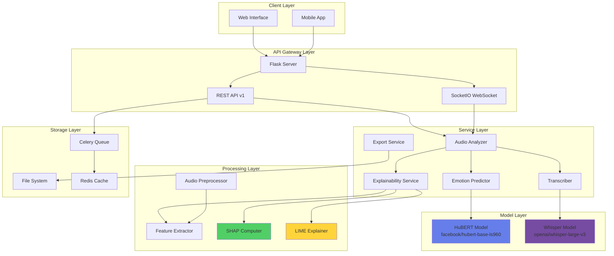

---

## 2. Architecture Layers

### 2.1. Presentation Layer

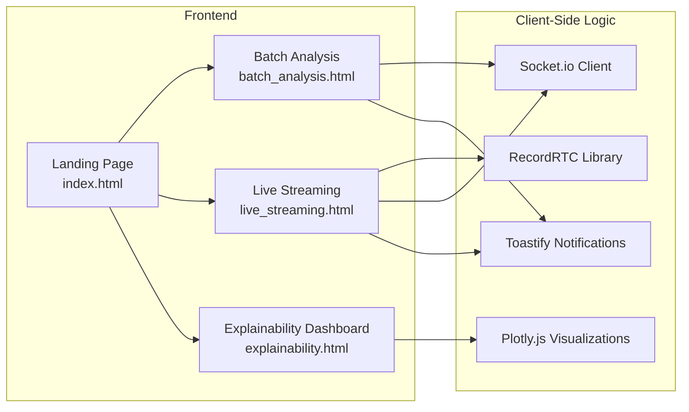

#### **Technologies**:

- HTML5 + CSS3 (Inter font family)
- Vanilla JavaScript (ES6+)
- Socket.io Client (v4.0.0)
- RecordRTC (WebRTC recording)
- Plotly.js (v2.27.0)
- Toastify.js (notifications)

### 2.2. Application Layer

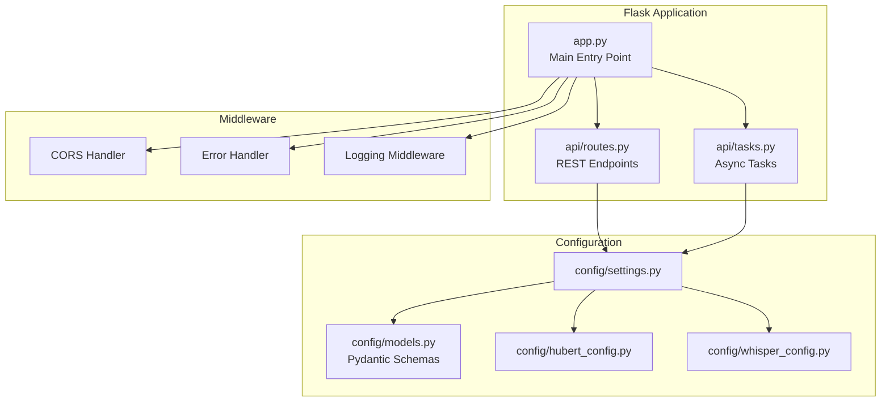

#### **Key Components**:

| Component | Purpose | Technology |
|-----------|---------|------------|
| Flask App | HTTP server | Flask 2.x |
| SocketIO | WebSocket server | Flask-SocketIO |
| Celery | Task queue | Celery + Redis |
| Pydantic | Data validation | Pydantic v2 |

### 2.3. Service Layer

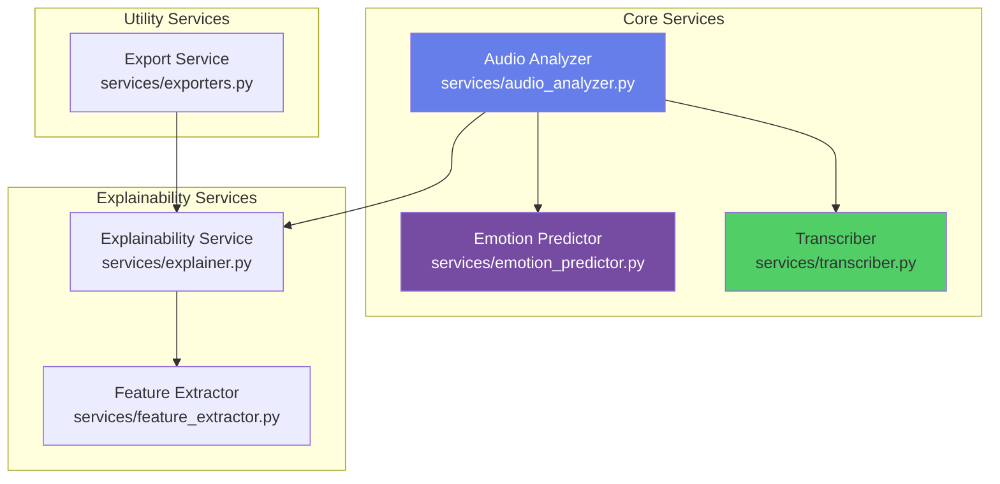

#### **Service Architecture Pattern: Singleton**

```python
# Pattern used across all services
class ServiceClass:
    def __init__(self):
        # Initialize heavy resources once
        self.model = load_model()
    
_instance = None

def get_service() -> ServiceClass:
    global _instance

    if _instance is None:
        _instance = ServiceClass()
    
    return _instance
```

---

## 3. Data Flow

### 3.1. Batch Analysis Flow

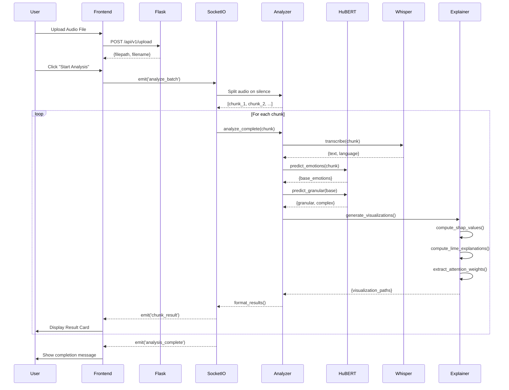

#### **Time Complexity**: O(n·m) where n = number of chunks, m = model inference time

### 3.2. Live Streaming Flow

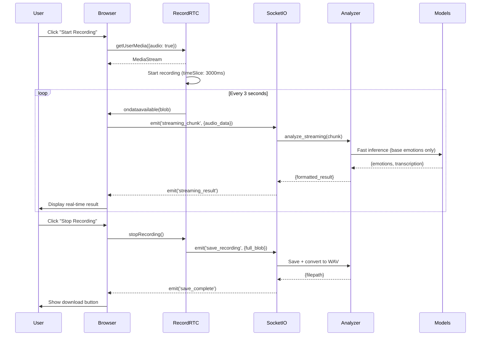

#### **Latency Target**: < 1ms per chunk (10-second audio)

### 3.3. Explainability Pipeline

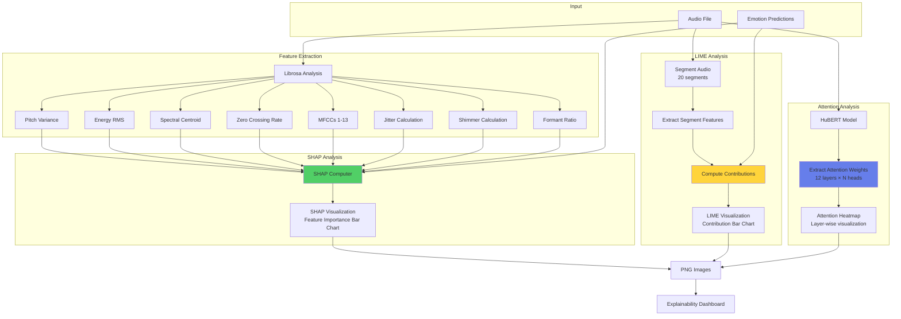

---

## 4. Model Architecture

### 4.1. HuBERT Architecture

```mermaid
graph TB
    subgraph "Input Processing"
        Audio[Raw Audio Waveform<br/>16kHz, Mono]
        Audio --> FeatureExtractor[Wav2Vec2 Feature Extractor<br/>Frame: 25ms, Stride: 20ms]
        FeatureExtractor --> Features[Feature Sequence<br/>Shape: [1, T, 768]]
    end
    
    subgraph "HuBERT Encoder"
        Features --> CNN[7-layer CNN<br/>Kernel: 10,3,3,3,3,2,2<br/>Stride: 5,2,2,2,2,2,2]
        CNN --> Transformer[12-layer Transformer<br/>Hidden: 768<br/>Heads: 12<br/>FFN: 3072]
        
        Transformer --> Layer1[Layer 1<br/>Self-Attention + FFN]
        Layer1 --> Layer2[Layer 2]
        Layer2 --> Layer3[...]
        Layer3 --> Layer12[Layer 12]
    end
    
    subgraph "Classification Head"
        Layer12 --> Pooling[Pooling Strategy<br/>Mean/Max/Sum]
        Pooling --> Dropout[Dropout: 0.1]
        Dropout --> Dense[Dense Layer: 768→768]
        Dense --> Tanh[Tanh Activation]
        Tanh --> Dropout2[Dropout: 0.1]
        Dropout2 --> Output[Output Layer: 768→6]
        Output --> Softmax[Softmax]
        Softmax --> Emotions[6 Emotion Probabilities]
    end
    
    style CNN fill:#667eea,color:#fff
    style Transformer fill:#764ba2,color:#fff
    style Pooling fill:#51cf66,color:#fff
```

#### **Model Specifications**:

| Parameter | Value |
|-----------|-------| 
| Architecture | HuBERT-Base |
| Parameters | ~95M |
| Hidden Size | 768 | 
| Layers | 12 | 
| Attention Heads| 12 |
| FFN Dimension| 3072 | 
| Pooling Mode | Mean (configurable)| 
| Output Classes | 6 emotions |

### 4.2. Whisper Architecture

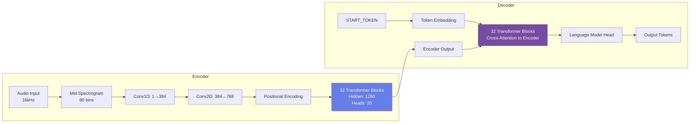

#### **Model Specifications**:

| Parameter | Whisper Large-v3 |
|-----------|------------------|
| Parameters | 1550M | 
| Encoder Layers | 32 | 
| Decoder Layers | 32 |
| Hidden Size | 1280 | 
| Attention Heads | 20 |
| Languages | 99+ | 
| Vocabulary | 51,865 tokens |

---

## 5. Mathematical Foundations

### 5.1. Emotion Detection

**Softmax Classification**

For a given audio feature vector x, the probability of emotion class i is:

```math
P(y=i∣x)=ezi∑j=1CezjP(y = i | \mathbf{x}) = \frac{e^{z_i}}{\sum_{j=1}^{C} e^{z_j}}P(y=i∣x)=∑j=1C​ezj​ezi​​
```

Where:

- zi=wiTh+biz_i = \mathbf{w}_i^T \mathbf{h} + b_i
- zi​=wiT​h+bi​ (logit for class *i*)

h\mathbf{h}
h = pooled hidden representation from HuBERT

C=6C = 6
C=6 (number of emotion classes)

wi,bi\mathbf{w}_i, b_i
wi​,bi​ = learned weights and bias


**Pooling Strategies**
**1. Mean Pooling:**

```math
hmean=1T∑t=1Tht\mathbf{h}_{mean} = \frac{1}{T} \sum_{t=1}^{T} \mathbf{h}_thmean​=T1​t=1∑T​ht​
```

**2. Max Pooling:**

```math
hmax=max⁡t=1Tht\mathbf{h}_{max} = \max_{t=1}^{T} \mathbf{h}_thmax​=t=1maxT​ht​
```

**3. Sum Pooling:**

```math
hsum=∑t=1Tht\mathbf{h}_{sum} = \sum_{t=1}^{T} \mathbf{h}_thsum​=t=1∑T​ht​
Where:

TT
T = sequence length

ht\mathbf{h}_t
ht​ = hidden state at time step *t*
```


### 5.2. Granular Emotion Mapping

Given base emotion probabilities:

```math
Pbase={p1,...,p6}P_{base} = \{p_1, ..., p_6\}

- Pbase​={p1​,...,p6​}:
```

- **Primary Granular Emotions**:

```math
Eprimary={Mapping[edominant].primaryif pdominant≥θprimary∅otherwiseE_{primary} = \begin{cases}
\text{Mapping}[e_{dominant}].\text{primary} & \text{if } p_{dominant} \geq \theta_{primary} \\
\emptyset & \text{otherwise}
\end{cases}Eprimary​={Mapping[edominant​].primary∅​if pdominant​≥θprimary​otherwise​
Secondary Granular Emotions:
Esecondary={Mapping[edominant].secondaryif 0.3≤pdominant<0.7∅otherwiseE_{secondary} = \begin{cases}
\text{Mapping}[e_{dominant}].\text{secondary} & \text{if } 0.3 \leq p_{dominant} < 0.7 \\
\emptyset & \text{otherwise}
\end{cases}Esecondary​={Mapping[edominant​].secondary∅​if 0.3≤pdominant​<0.7otherwise​
Where:

edominant=arg⁡max⁡ipie_{dominant} = \arg\max_i p_i
edominant​=argmaxi​pi​
θprimary\theta_{primary}
θprimary​ = threshold (default: 0.3-0.4)
```


### 5.3. Complex Emotion Detection

For emotion fusion, given top-2 emotions (e1,e2)(e_1, e_2)

```math
(e1​,e2​) with probabilities (p1,p2)(p_1, p_2)
(p1​,p2​):

Blended Emotion Score:
scomplex=p1+p22s_{complex} = \frac{p_1 + p_2}{2}scomplex​=2p1​+p2​​
Complex Emotion Assignment:
Ecomplex={ComplexMap[(e1,e2)]if scomplex>0.3 and (e1,e2)∈ComplexMap∅otherwiseE_{complex} = \begin{cases}
\text{ComplexMap}[(e_1, e_2)] & \text{if } s_{complex} > 0.3 \text{ and } (e_1, e_2) \in \text{ComplexMap} \\
\emptyset & \text{otherwise}
\end{cases}Ecomplex​={ComplexMap[(e1​,e2​)]∅​if scomplex​>0.3 and (e1​,e2​)∈ComplexMapotherwise​
Example mappings:

(Happiness, Surprise) → Elation
(Sadness, Anger) → Bitterness
(Fear, Sadness) → Desperation
```

### 5.4. SHAP Feature Attribution

```math
For feature *j*, the SHAP value ϕj\phi_j
ϕj​ represents its contribution to prediction:

ϕj=∑S⊆F∖{j}∣S∣!(∣F∣−∣S∣−1)!∣F∣![fS∪{j}(x)−fS(x)]\phi_j = \sum_{S \subseteq F \setminus \{j\}} \frac{|S|!(|F| - |S| - 1)!}{|F|!} [f_{S \cup \{j\}}(\mathbf{x}) - f_S(\mathbf{x})]ϕj​=S⊆F∖{j}∑​∣F∣!∣S∣!(∣F∣−∣S∣−1)!​[fS∪{j}​(x)−fS​(x)]
Simplified Approximation (used in implementation):
ϕj≈fj⋅pdominant⋅wemotion,j\phi_j \approx f_j \cdot p_{dominant} \cdot w_{emotion,j}ϕj​≈fj​⋅pdominant​⋅wemotion,j​
Where:

fjf_j
fj​ = normalized feature value (0-1)

pdominantp_{dominant}
pdominant​ = confidence of dominant emotion

wemotion,jw_{emotion,j}
wemotion,j​ = emotion-specific feature weight


Normalization:
ϕjnorm=ϕj∑k=1nϕk\phi_j^{norm} = \frac{\phi_j}{\sum_{k=1}^{n} \phi_k}ϕjnorm​=∑k=1n​ϕk​ϕj​​
```

### 5.5. LIME Local Explanations

```math
Audio is segmented into N segments. For segment i:
Contribution Score:
ci=α⋅Energyi+β⋅PitchVari−γc_i = \alpha \cdot \text{Energy}_i + \beta \cdot \text{PitchVar}_i - \gammaci​=α⋅Energyi​+β⋅PitchVari​−γ
Where:

Energyi=1L∑t=1Lxi,t2\text{Energy}_i = \sqrt{\frac{1}{L} \sum_{t=1}^{L} x_{i,t}^2}
Energyi​=L1​∑t=1L​xi,t2​​ (RMS energy)

PitchVari=Var(xi,t)\text{PitchVar}_i = \text{Var}(x_{i,t})
PitchVari​=Var(xi,t​) (pitch variance)

α=2.0,β=0.5,γ=0.5\alpha = 2.0, \beta = 0.5, \gamma = 0.5
α=2.0,β=0.5,γ=0.5 (empirical weights)

ci∈[−1,1]c_i \in [-1, 1]
ci​∈[−1,1] (clipped)


Positive/Negative Contributors:
Positive={i:ci>0.2}\text{Positive} = \{i : c_i > 0.2\}Positive={i:ci​>0.2}
Negative={i:ci<−0.2}\text{Negative} = \{i : c_i < -0.2\}Negative={i:ci​<−0.2}
```

### 5.6. Attention Mechanism

```math
Multi-Head Self-Attention:
Attention(Q,K,V)=softmax(QKTdk)V\text{Attention}(Q, K, V) = \text{softmax}\left(\frac{QK^T}{\sqrt{d_k}}\right)VAttention(Q,K,V)=softmax(dk​​QKT​)V
Multi-Head Output:
MultiHead(Q,K,V)=Concat(head1,...,headh)WO\text{MultiHead}(Q, K, V) = \text{Concat}(\text{head}_1, ..., \text{head}_h)W^OMultiHead(Q,K,V)=Concat(head1​,...,headh​)WO
Where:

headi=Attention(QWiQ,KWiK,VWiV)\text{head}_i = \text{Attention}(QW_i^Q, KW_i^K, VW_i^V)headi​=Attention(QWiQ​,KWiK​,VWiV​)
For HuBERT:

h=12h = 12
h=12 attention heads

dk=64d_k = 64
dk​=64 (key dimension)

dmodel=768d_{model} = 768
dmodel​=768
```

### 5.7. Audio Feature Extraction

```math
Mel-Frequency Cepstral Coefficients (MFCCs)
MFCCk=∑m=1Mlog⁡(Sm)cos⁡[k(m−0.5)πM]\text{MFCC}_k = \sum_{m=1}^{M} \log(S_m) \cos\left[k(m - 0.5)\frac{\pi}{M}\right]MFCCk​=m=1∑M​log(Sm​)cos[k(m−0.5)Mπ​]
Where:

SmS_m
Sm​ = mel-scale power spectrum

MM
M = number of mel filters (typically 40)

kk
k = cepstral coefficient index (1-13)


Jitter (Period Perturbation)
Jitter=StdDev(ΔT)Mean(T)\text{Jitter} = \frac{\text{StdDev}(\Delta T)}{\text{Mean}(T)}Jitter=Mean(T)StdDev(ΔT)​
Where:

TT
T = fundamental period

ΔT\Delta T
ΔT = period-to-period differences


Shimmer (Amplitude Perturbation)
Shimmer=StdDev(ΔA)Mean(A)\text{Shimmer} = \frac{\text{StdDev}(\Delta A)}{\text{Mean}(A)}Shimmer=Mean(A)StdDev(ΔA)​
Where:

AA
A = peak amplitude

ΔA\Delta A
ΔA = amplitude differences
```
---

## 6. Component Specifications

### 6.1. Audio Processing Pipeline

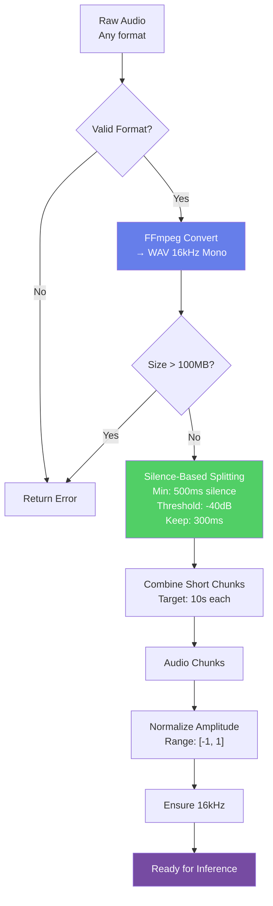

#### **Parameters**:

```python
AUDIO_PROCESSING = {'sample_rate'         : 16000,              # Hz
                    'channels'            : 1,                  # Mono
                    'silence_threshold'   : -40,                # dBFS
                    'min_silence_length'  : 500,                # ms
                    'keep_silence'        : 300,                # ms
                    'target_chunk_length' : 10000,              # ms (10 seconds)
                    'max_file_size'       : 100 * 1024 * 1024,  # 100MB
                   }
```

### 6.2. Emotion Prediction Pipeline

```python
class EmotionPipeline:
    """
    Complete emotion prediction pipeline
    """
    
    def predict(self, audio_path: str) -> EmotionResult:
        # Load and preprocess audio: O(n)
        audio            = self.load_audio(audio_path)        
        
        # Extract features: O(n)
        features         = self.extract_features(audio)    
        
        # HuBERT inference: O(T × d²)
        logits           = self.model(features)              
        
        # Compute probabilities: O(C)
        base_emotions    = softmax(logits)            
        
        # Granular mapping: O(C)
        granular         = self.map_granular(base_emotions)  
        
        # Complex detection: O(C²)
        complex_emotions = self.detect_complex(base_emotions)  
        
        return EmotionResult(base     = base_emotions,
                             granular = granular,
                             complex  = complex_emotions,
                            )
```

#### **Time Complexity**:

- Audio loading: O(n) where n = audio length
- Feature extraction: O(n)
- Model inference: O(T × d²) where T = sequence length, d = hidden dim
- Post-processing: O(C²) where C = number of classes (6)
- Total: O(n + T × d²)

### 6.3. Explainability Generation

```python
class ExplainabilityPipeline:
    """
    Generate all explainability visualizations
    """
    
    def generate_all(self, audio_path: str, emotions: Dict) -> Paths:
        # Extract acoustic features: O(n)
        features    = self.feature_extractor.extract(audio_path)  
        
        # Compute SHAP values: O(f × C)
        shap_values = self.compute_shap(features, emotions)       
        
        # Compute LIME explanations: O(s × m)
        lime_data   = self.compute_lime(audio_path, emotions)    
        
        # Extract attention weights: O(T × L × H)
        attention   = self.extract_attention(audio_path)         
        
        # Generate visualizations
        paths       = {'emotion_dist' : self.plot_emotions(emotions),
                       'shap'         : self.plot_shap(shap_values),
                       'lime'         : self.plot_lime(lime_data),
                       'attention'    : self.plot_attention(attention),
                      }
        
        return paths
```

#### **Time Complexity**:

- Feature extraction: O(n)
- SHAP computation: O(f × C) where f = features, C = classes
- LIME computation: O(s × m) where s = segments, m = model calls
- Attention extraction: O(T × L × H) where L = layers, H = heads
- Visualization: O(f + s + L)
- Total: O(n + s × m + T × L × H)

---

## 7. API Architecture

### 7.1. REST API Endpoints

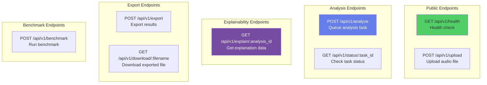

### 7.2. API Request/Response Schemas

#### 7.2.1

- `POST /api/v1/analyze`

- `Request`:
```python
{
  "filepath": "/path/to/audio.wav",
  "emotion_mode": "both",
  "language": "en",
  "export_format": "json"
}
```
- `Response`:
```python
{
  "analysis_id": "ca045b0a-1344-46fe-ad2c-c37c79ef",
  "status": "pending",
  "task_id": "a7f8b3c2-9d4e-11eb-a8b3-0242ac130003",
  "status_url": "/api/v1/status/a7f8b3c2-9d4e-11eb-a8b3-0242ac130003",
  "created_at": "2025-12-07T10:30:00Z"
}
```

#### 7.2.2

- `GET /api/v1/status/:task_id`

- Response (200 OK - Processing):

```json{
  "status": "processing",
  "progress": 45,
  "message": "Analyzing segment 3/8..."
}
```

- Response (200 OK - Complete):

```json{
  "status": "completed",
  "progress": 100,
  "message": "Analysis complete",
  "result": {
    "transcription": {
      "text": "Hello world",
      "language": "English",
      "language_code": "en",
      "confidence": 0.98
    },
    "emotions": {
      "base": [
        {"label": "Happiness", "score": 0.72, "percentage": "72.00%"},
        {"label": "Neutral", "score": 0.15, "percentage": "15.00%"}
      ],
      "primary": {
        "emotions": ["Joy", "Delight", "Enthusiasm"],
        "confidence": "72.00%"
      },
      "secondary": null,
      "complex": []
    },
    "metadata": {
      "analysis_id": "ca045b0a-1344-46fe-ad2c-c37c79ef",
      "processing_time": 1.45
    }
  }
}
```

### 7.3. WebSocket Events

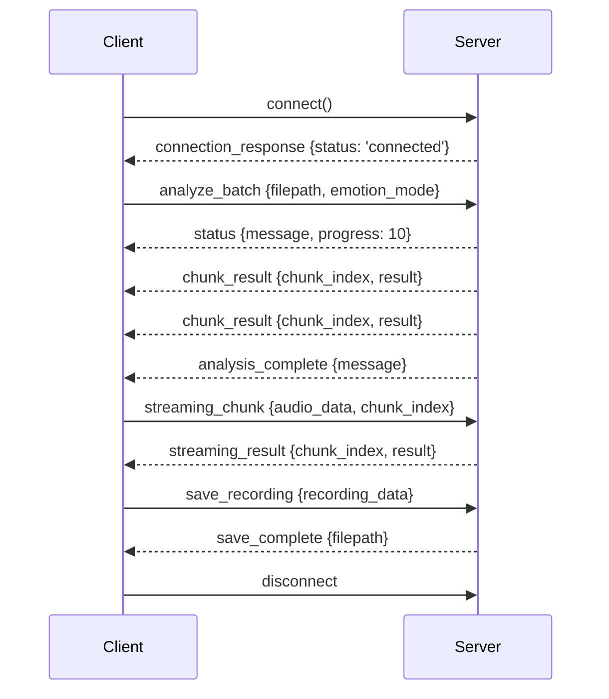


