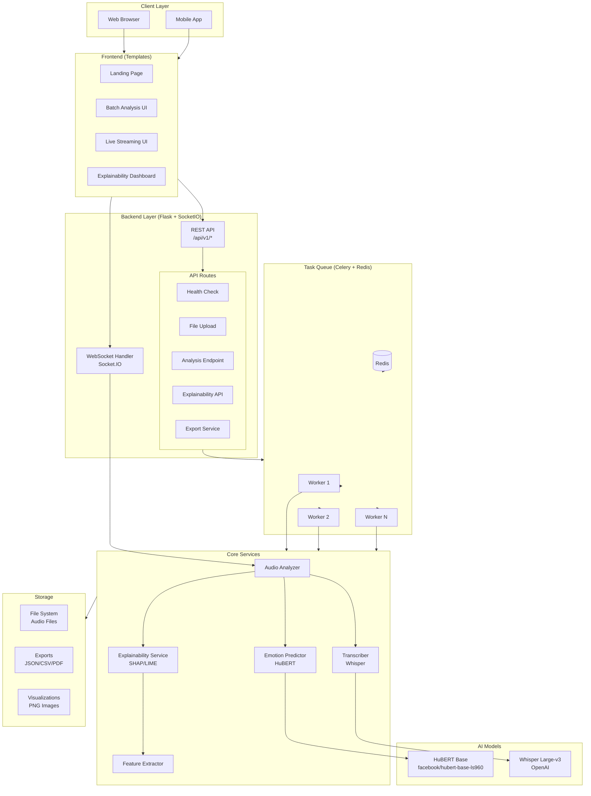
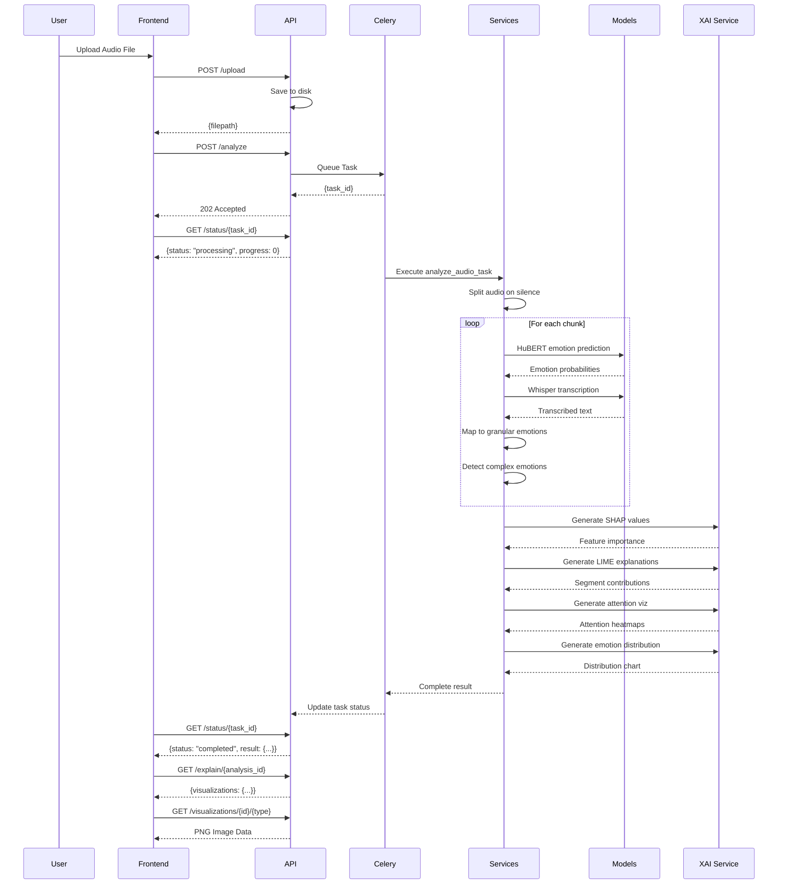
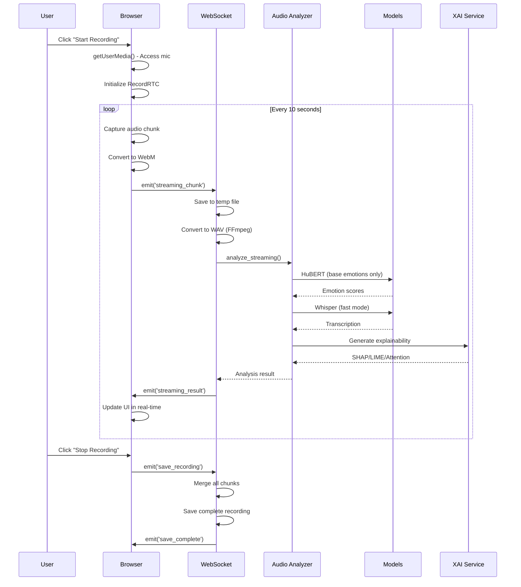

# EmotiVoice System Architecture

**Version:** 1.0.0  
**Last Updated:** December 2025

---

## Table of Contents

1. [System Overview](#system-overview)
2. [Architecture Diagrams](#architecture-diagrams)
3. [Component Design](#component-design)
4. [Data Flow](#data-flow)
5. [AI Models & Mathematics](#ai-models--mathematics)
6. [Processing Pipeline](#processing-pipeline)
7. [Technology Stack](#technology-stack)

---

## System Overview

EmotiVoice is a production-grade speech emotion recognition and transcription platform that combines state-of-the-art deep learning models (HuBERT for emotion classification and Whisper for transcription) with explainable AI techniques (SHAP, LIME, attention visualization).

### Key Capabilities

- **Multi-level Emotion Recognition:** Base (6), Granular (20+), Complex (combinations)
- **Multilingual Transcription:** 90+ languages via Whisper large-v3
- **Real-time Streaming:** WebSocket-based live audio processing
- **Explainable AI:** SHAP, LIME, attention heatmaps for transparency
- **Scalable Architecture:** Async task processing with Celery

---

## Architecture Diagrams

### High-Level System Architecture



### Request Flow - Batch Analysis



### Request Flow - Live Streaming



### Component Interaction - Emotion Prediction

```mermaid
graph LR
    subgraph Input
        AUDIO[Audio File<br/>WAV/MP3/etc.]
    end
    
    subgraph Preprocessing
        CONVERT[FFmpeg<br/>Convert to WAV]
        LOAD[Load as Tensor<br/>torchaudio]
        RESAMPLE[Resample to 16kHz<br/>if needed]
        MONO[Convert to Mono<br/>if stereo]
    end
    
    subgraph Feature Extraction
        FEAT[Wav2Vec2<br/>Feature Extractor]
        FEATS[Raw Audio Features<br/>768-dim]
    end
    
    subgraph Model Inference
        HUBERT[HuBERT Model<br/>12 Transformer Layers]
        POOL[Pooling Layer<br/>Mean pooling]
        CLASSIFIER[Classification Head<br/>Dense + Dropout]
        SOFTMAX[Softmax<br/>6 class probabilities]
    end
    
    subgraph Postprocessing
        BASE[Base Emotions<br/>6 classes]
        GRANULAR[Granular Mapping<br/>20+ emotions]
        COMPLEX[Complex Detection<br/>Elation, etc.]
    end
    
    subgraph Output
        RESULT[Emotion Results<br/>JSON]
    end
    
    AUDIO --> CONVERT
    CONVERT --> LOAD
    LOAD --> RESAMPLE
    RESAMPLE --> MONO
    MONO --> FEAT
    FEAT --> FEATS
    FEATS --> HUBERT
    HUBERT --> POOL
    POOL --> CLASSIFIER
    CLASSIFIER --> SOFTMAX
    SOFTMAX --> BASE
    BASE --> GRANULAR
    BASE --> COMPLEX
    GRANULAR --> RESULT
    COMPLEX --> RESULT
```



---

## Component Design

### 1. Audio Analyzer (`services/audio_analyzer.py`)

**Responsibility:** Orchestrate complete audio analysis pipeline

**Key Methods:**
- `analyze_complete()`: Full analysis (transcription + emotions)
- `analyze_streaming()`: Fast analysis for real-time (base emotions only)
- `format_results_for_display()`: Format results for frontend

**Design Pattern:** Singleton (via `get_audio_analyzer()`)

---

### 2. Emotion Predictor (`services/emotion_predictor.py`)

**Responsibility:** HuBERT-based emotion classification

**Architecture:**

```
HubertForSpeechClassification
├── HubertModel (facebook/hubert-base-ls960)
│   ├── Feature Extractor: 7 CNN layers
│   ├── Encoder: 12 Transformer layers
│   │   ├── Hidden size: 768
│   │   ├── Attention heads: 12
│   │   └── Intermediate size: 3072
│   └── Pooling: Mean over sequence length
└── Classification Head
    ├── Dense(768 → 768) + Tanh
    ├── Dropout(0.1)
    └── Output(768 → 6)
```

**Key Methods:**
- `predict_base_emotions()`: Returns 6 base emotion probabilities
- `predict_granular_emotions()`: Maps to 20+ granular emotions
- `get_attention_weights()`: Extracts attention for explainability

---

### 3. Transcriber (`services/transcriber.py`)

**Responsibility:** Multilingual speech-to-text via Whisper

**Model:** Whisper Large-v3 (1550M parameters)

**Key Methods:**
- `transcribe()`: Full-quality transcription (beam_size=5)
- `transcribe_streaming()`: Fast transcription (beam_size=1)

**Configuration:**
- Sample rate: 16kHz
- Task: Transcribe (not translate)
- Language: Auto-detect or specified
- Beam search: 5 (batch) / 1 (streaming)

---

### 4. Explainability Service (`services/explainer.py`)

**Responsibility:** Generate SHAP, LIME, and attention visualizations

**Key Methods:**
- `compute_shap_values()`: Feature importance via SHAP-like analysis
- `compute_lime_explanations()`: Local segment contributions
- `generate_attention_visualization()`: Attention heatmaps
- `generate_emotion_distribution()`: Emotion probability charts

**Design:** Uses matplotlib/seaborn for publication-quality visualizations

---

### 5. Feature Extractor (`services/feature_extractor.py`)

**Responsibility:** Extract acoustic features for explainability

**Features Extracted:**

| Feature | Description | Use Case |
|---------|-------------|----------|
| Pitch Variance | Voice pitch variability | Distinguishes arousal (excitement vs. calm) |
| Energy (RMS) | Signal amplitude | Indicates vocal intensity |
| Speaking Rate | Tempo estimation | Fast (excitement) vs. slow (sadness) |
| Spectral Centroid | Frequency center of mass | Voice quality, brightness |
| Zero Crossing Rate | Sign changes per second | Voicing vs. unvoiced sounds |
| MFCCs (13) | Mel-frequency cepstral coefficients | Timbre, phonetic content |
| Jitter | Period perturbation | Voice quality, stress |
| Shimmer | Amplitude perturbation | Voice quality, emotion |
| Formant Ratio | F1/F2 ratio approximation | Vowel space, emotion |

---

## Data Flow

### 1. Audio Processing Pipeline

```
Raw Audio (any format)
    ↓
[FFmpeg Conversion] → WAV, 16kHz, Mono, PCM_S16LE
    ↓
[torchaudio Load] → PyTorch Tensor
    ↓
[Resampling] → Ensure 16kHz
    ↓
[Mono Conversion] → Average channels if stereo
    ↓
[Normalization] → Scale to [-1, 1]
    ↓
Ready for Model Input
```

### 2. Emotion Recognition Pipeline

```
Audio Tensor (16kHz mono)
    ↓
[Wav2Vec2 Feature Extractor] → Padding, Normalization
    ↓
[HuBERT CNN Feature Extractor] → 7 layers, stride [5,2,2,2,2,2,2]
    ↓
[HuBERT Transformer Encoder] → 12 layers, 768-dim, 12 heads
    ↓
[Mean Pooling] → Average over sequence length
    ↓
[Classification Head] → Dense(768→768) + Tanh + Dropout + Dense(768→6)
    ↓
[Softmax] → Probabilities for 6 emotions
    ↓
[Granular Mapping] → Apply thresholds, map to 20+ emotions
    ↓
[Complex Detection] → Detect emotion combinations (Elation, etc.)
    ↓
Final Emotion Result
```

### 3. Explainability Pipeline

```
Audio + Emotion Scores
    ↓
[Feature Extraction] → 10 acoustic features
    ↓
[SHAP Computation]
    ├── Normalize features → [0, 1]
    ├── Weight by dominant emotion score
    ├── Apply emotion-specific feature weights
    └── Normalize to sum=1
    ↓
[LIME Computation]
    ├── Split audio into N segments
    ├── Extract segment features (energy, pitch, ZCR)
    ├── Compute contribution per segment
    └── Identify positive/negative contributors
    ↓
[Attention Extraction]
    ├── Forward pass with output_attentions=True
    ├── Extract attention weights from layers
    └── Average over attention heads
    ↓
[Visualization Generation]
    ├── Emotion distribution bar chart
    ├── SHAP importance bar chart
    ├── LIME contribution bar chart
    └── Attention heatmaps (multiple layers)
    ↓
PNG Images Saved to exports/visualizations/
```

---

## AI Models & Mathematics

### HuBERT (Hidden-Unit BERT)

**Paper:** [HuBERT: Self-Supervised Speech Representation Learning by Masked Prediction of Hidden Units](https://arxiv.org/abs/2106.07447)

**Architecture:**

The model consists of a CNN feature extractor followed by a BERT-like Transformer encoder.

#### 1. CNN Feature Extractor

Processes raw waveform to extract acoustic features:

$$
\begin{align}
\text{Conv}_i: \mathbb{R}^{L_{i-1}} &\to \mathbb{R}^{L_i} \\
L_i &= \frac{L_{i-1} - k_i}{s_i} + 1
\end{align}
$$

Where:
- $L_i$ = sequence length at layer $i$
- $k_i$ = kernel size
- $s_i$ = stride

**EmotiVoice Configuration:**
- 7 CNN layers
- Strides: [5, 2, 2, 2, 2, 2, 2]
- Output: 768-dimensional features

#### 2. Transformer Encoder

Applies self-attention to capture contextual information:

$$
\begin{align}
\text{Attention}(Q, K, V) &= \text{softmax}\left(\frac{QK^T}{\sqrt{d_k}}\right)V \\
\text{MultiHead}(Q, K, V) &= \text{Concat}(\text{head}_1, ..., \text{head}_h)W^O \\
\text{where } \text{head}_i &= \text{Attention}(QW_i^Q, KW_i^K, VW_i^V)
\end{align}
$$

**EmotiVoice Configuration:**
- 12 Transformer layers
- Hidden size: $d_{model} = 768$
- Attention heads: $h = 12$
- $d_k = d_v = d_{model} / h = 64$
- Feed-forward size: $d_{ff} = 3072$

#### 3. Pooling Strategy

Mean pooling over sequence length:

$$
\mathbf{h}_{\text{pooled}} = \frac{1}{T} \sum_{t=1}^{T} \mathbf{h}_t
$$

Where $T$ is the sequence length and $\mathbf{h}_t \in \mathbb{R}^{768}$.

#### 4. Classification Head

$$
\begin{align}
\mathbf{z} &= \tanh(W_1 \mathbf{h}_{\text{pooled}} + b_1) \\
\mathbf{z}' &= \text{Dropout}(\mathbf{z}, p=0.1) \\
\mathbf{logits} &= W_2 \mathbf{z}' + b_2 \\
\mathbf{p} &= \text{softmax}(\mathbf{logits})
\end{align}
$$

Where:
- $W_1 \in \mathbb{R}^{768 \times 768}$, $b_1 \in \mathbb{R}^{768}$
- $W_2 \in \mathbb{R}^{6 \times 768}$, $b_2 \in \mathbb{R}^{6}$
- $\mathbf{p} \in \mathbb{R}^6$ (probability distribution over 6 emotions)

#### 5. Loss Function

Cross-entropy loss for single-label classification:

$$
\mathcal{L} = -\sum_{i=1}^{6} y_i \log(p_i)
$$

Where $\mathbf{y}$ is the one-hot encoded ground truth.

---

### Whisper

**Paper:** [Robust Speech Recognition via Large-Scale Weak Supervision](https://arxiv.org/abs/2212.04356)

**Architecture:** Encoder-Decoder Transformer

#### 1. Encoder

Processes log-mel spectrogram:

$$
\begin{align}
X_{\text{mel}} &= \text{log-mel-spectrogram}(\text{audio}) \\
X_{\text{mel}} &\in \mathbb{R}^{80 \times T}
\end{align}
$$

Where:
- 80 mel-frequency bins
- $T$ = time steps (30 seconds → 3000 frames at 10ms stride)

**Whisper Large-v3:**
- 32 encoder layers
- Hidden size: 1280
- Attention heads: 20
- Parameters: ~1550M

#### 2. Decoder

Auto-regressive generation with beam search:

$$
\begin{align}
P(w_t | w_{<t}, X) &= \text{softmax}(W_{\text{vocab}} h_t) \\
w_t^* &= \underset{w_t}{\arg\max} \, P(w_t | w_{<t}, X)
\end{align}
$$

**EmotiVoice Configuration:**
- Beam size: 5 (batch) / 1 (streaming)
- Temperature: 0.0 (deterministic)
- Language: Auto-detect or specified

---

### Granular Emotion Mapping

**Algorithm:**

```
Input: Base emotion probabilities p = [p₁, p₂, ..., p₆]
Output: Granular emotions (primary, secondary)

1. dominant_emotion = argmax(p)
2. dominant_score = p[dominant_emotion]

3. IF dominant_score ≥ threshold_emotion:
     primary_emotions = GRANULAR_MAP[dominant_emotion]["primary"]
     
4. IF 0.3 ≤ dominant_score < 0.7:
     secondary_emotions = GRANULAR_MAP[dominant_emotion]["secondary"]
     secondary_confidence = dominant_score × 0.7
     
5. RETURN (primary_emotions, secondary_emotions)
```

**Thresholds:**
- Anger, Fear, Happiness, Sadness, Surprise: 0.3
- Neutral: 0.4 (higher threshold for neutral)

---

### Complex Emotion Detection

**Algorithm:**

```
Input: Base emotion probabilities p = [p₁, p₂, ..., p₆]
Output: Complex emotions

1. sorted_emotions = sort(p, descending=True)
2. top_two = (sorted_emotions[0], sorted_emotions[1])

3. FOR each (emotion_pair, complex_name) in COMPLEX_EMOTIONS:
     IF set(top_two) == set(emotion_pair):
         avg_score = (top_two[0].score + top_two[1].score) / 2
         
         IF avg_score > 0.3:
             RETURN complex_name with confidence = avg_score
             
4. RETURN []
```

**Complex Emotion Mappings:**
- (Happiness, Surprise) → Elation
- (Sadness, Anger) → Bitterness
- (Fear, Sadness) → Desperation
- (Happiness, Neutral) → Contentment
- (Anger, Fear) → Panic
- (Sadness, Neutral) → Resignation

---

### SHAP-like Feature Importance

**Algorithm:**

```
Input: Audio features f = [f₁, f₂, ..., f₁₀], Emotion scores p
Output: SHAP values s = [s₁, s₂, ..., s₁₀]

1. dominant_emotion = argmax(p)
2. dominant_score = p[dominant_emotion]

3. FOR each feature fᵢ:
     normalized_fᵢ = clip(fᵢ, 0, 1)
     importance_i = normalized_fᵢ × dominant_score
     weight_i = EMOTION_FEATURE_WEIGHT[dominant_emotion][feature_i]
     importance_i = importance_i × weight_i
     
4. Normalize: s = importance / sum(importance)

5. RETURN s (sorted by importance)
```

**Emotion-Feature Weight Matrix:**

| Emotion | Pitch Variance | Energy | Speaking Rate | Spectral Centroid |
|---------|----------------|--------|---------------|-------------------|
| Happiness | 1.2 | 1.3 | 1.1 | 1.0 |
| Anger | 1.3 | 1.4 | 1.1 | 1.0 |
| Sadness | 0.6 | 0.7 | 0.8 | 0.9 |
| Fear | 1.3 | 1.0 | 1.0 | 1.0 |
| Surprise | 1.4 | 1.2 | 1.0 | 1.0 |
| Neutral | 0.8 | 0.9 | 1.0 | 1.0 |

---

### LIME-like Local Explanations

**Algorithm:**

```
Input: Audio waveform x, Dominant emotion e
Output: Segment contributions c = [c₁, c₂, ..., cₙ]

1. n_segments = min(20, max(5, duration_seconds))
2. segments = split_audio(x, n_segments)

3. FOR each segment xᵢ:
     energy_i = sqrt(mean(xᵢ²))
     zcr_i = mean(zero_crossing_rate(xᵢ))
     pitch_var_i = var(xᵢ)
     
     IF e in ["Happiness", "Surprise"]:
         contribution_i = (energy_i × 2.0) + (pitch_var_i × 0.5) - 0.5
     
     ELSE IF e == "Sadness":
         contribution_i = (1.0 - energy_i) × 1.5 - 0.5
     
     ELSE IF e == "Anger":
         contribution_i = (energy_i × 2.5) + (pitch_var_i × 0.8) - 0.6
     
     ELSE IF e == "Fear":
         contribution_i = (pitch_var_i × 1.5) + (zcr_i × 1.0) - 0.5
     
     ELSE:  # Neutral
         contribution_i = (energy_i × 0.5) - 0.3
     
     c_i = clip(contribution_i, -1.0, 1.0)

4. positive_segments = {i | c_i > 0.2}
5. negative_segments = {i | c_i < -0.2}

6. RETURN (c, positive_segments, negative_segments)
```

---

## Processing Pipeline

### Batch Analysis Pipeline

```
1. File Upload
   ├── Validate file type and size
   ├── Generate unique filename (UUID)
   └── Save to data/uploaded_files/

2. Analysis Request
   ├── Validate filepath exists
   ├── Create analysis_id (UUID)
   ├── Queue Celery task
   └── Return 202 Accepted with task_id

3. Celery Worker Execution
   ├── Convert audio to WAV (FFmpeg)
   ├── Split on silence → N chunks
   └── FOR each chunk:
        ├── Load as tensor
        ├── HuBERT emotion prediction
        ├── Whisper transcription
        ├── Map to granular emotions
        ├── Detect complex emotions
        ├── Generate SHAP values
        ├── Generate LIME explanations
        ├── Generate attention heatmaps
        ├── Generate emotion distribution
        └── Store visualizations

4. Result Formatting
   ├── Format emotions (raw → percentages)
   ├── Compile metadata (processing_time, analysis_id)
   └── Return complete result

5. Client Polling
   ├── GET /status/{task_id}
   ├── Check task state (PENDING → PROCESSING → SUCCESS)
   └── Return result when complete
```

### Streaming Pipeline

```
1. Client Initialization
   ├── Request microphone access
   ├── Initialize RecordRTC
   └── Connect WebSocket

2. Recording Loop (every 10 seconds)
   ├── Capture audio chunk (WebM)
   ├── Emit 'streaming_chunk' event
   └── Server receives chunk

3. Server Processing
   ├── Save chunk to temp file
   ├── Convert to WAV (fast FFmpeg)
   ├── Load as tensor
   ├── HuBERT prediction (base emotions only)
   ├── Whisper transcription (beam_size=1)
   ├── Generate explainability (SHAP/LIME/Attention)
   └── Emit 'streaming_result' event

4. Client Updates
   ├── Receive result
   ├── Update UI in real-time
   ├── Display transcription
   └── Show emotion scores

5. Recording Stop
   ├── Stop media tracks
   ├── Emit 'save_recording' event
   ├── Server merges all chunks
   └── Save complete recording
```

---

## Technology Stack

### Backend

| Component | Technology | Version | Purpose |
|-----------|-----------|---------|---------|
| Web Framework | Flask | 3.0.0 | REST API, routing |
| WebSocket | Flask-SocketIO | 5.3.5 | Real-time communication |
| Task Queue | Celery | 5.3.4 | Async processing |
| Message Broker | Redis | 5.0.1 | Celery backend |
| Validation | Pydantic | 2.5.0 | Data validation |

### AI/ML

| Component | Technology | Version | Purpose |
|-----------|-----------|---------|---------|
| Deep Learning | PyTorch | Latest | Model inference |
| Audio Processing | torchaudio | Latest | Tensor operations |
| Transformers | transformers | 4.36.0 | HuBERT model |
| ASR | openai-whisper | 20231117 | Transcription |
| Explainability | SHAP | 0.43.0 | Feature importance |
| Explainability | LIME | 0.2.0.1 | Local explanations |

### Audio Processing

| Component | Technology | Purpose |
|-----------|-----------|---------|
| Conversion | FFmpeg | Format conversion |
| Manipulation | pydub | Silence splitting |
| Features | librosa | Acoustic features |
| I/O | scipy | WAV read/write |

### Visualization

| Component | Technology | Purpose |
|-----------|-----------|---------|
| Plotting | matplotlib | Charts |
| Heatmaps | seaborn | Attention viz |

### Deployment

| Component | Technology | Purpose |
|-----------|-----------|---------|
| Containerization | Docker | Deployment |
| Environment | python:3.10-slim | Base image |
| Models | HuggingFace Hub | Model storage |

---

## Performance Considerations

### Model Inference Times (CPU)

- **HuBERT (10s audio):** ~1.5-2.0 seconds
- **Whisper Large-v3 (10s audio):** ~3-5 seconds
- **Total per chunk:** ~5-7 seconds

### Optimization Strategies

1. **Batch Processing:** Process multiple chunks in parallel with ThreadPoolExecutor
2. **Streaming Mode:** Use beam_size=1 for Whisper (3x faster)
3. **Model Caching:** Singleton pattern prevents reloading
4. **GPU Support:** Configurable via DEVICE environment variable
5. **Audio Chunking:** Split long files to enable parallel processing

---

## Security Considerations

1. **Input Validation:** Pydantic models enforce strict schemas
2. **File Upload:** 100MB limit, allowed extensions only
3. **Path Traversal:** Normalized paths, directory checks
4. **Resource Limits:** Task time limits (10 min), worker task limits
5. **Error Handling:** No sensitive info in error messages

---

## Scalability

### Horizontal Scaling

- **Celery Workers:** Add more workers for increased throughput
- **Redis:** Use Redis Cluster for high availability
- **Load Balancer:** Nginx/HAProxy for multiple Flask instances

### Vertical Scaling

- **GPU:** Set DEVICE=cuda for 5-10x speedup
- **Model Quantization:** Reduce precision for faster inference
- **Batch Size:** Increase for higher throughput

---

**For implementation details, see the codebase and API documentation.**